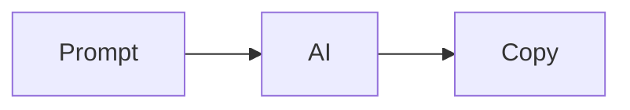
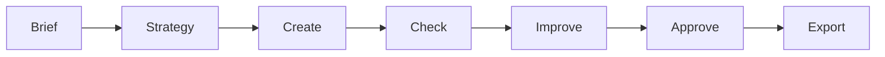
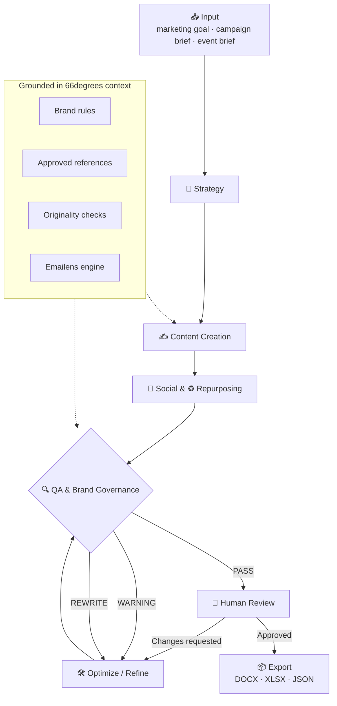
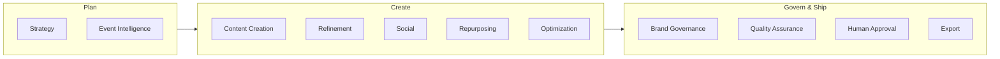
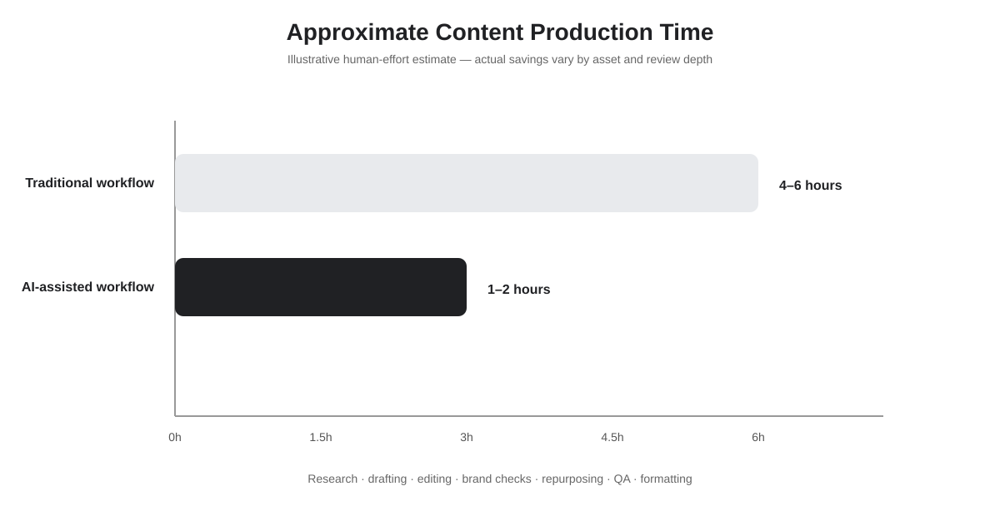
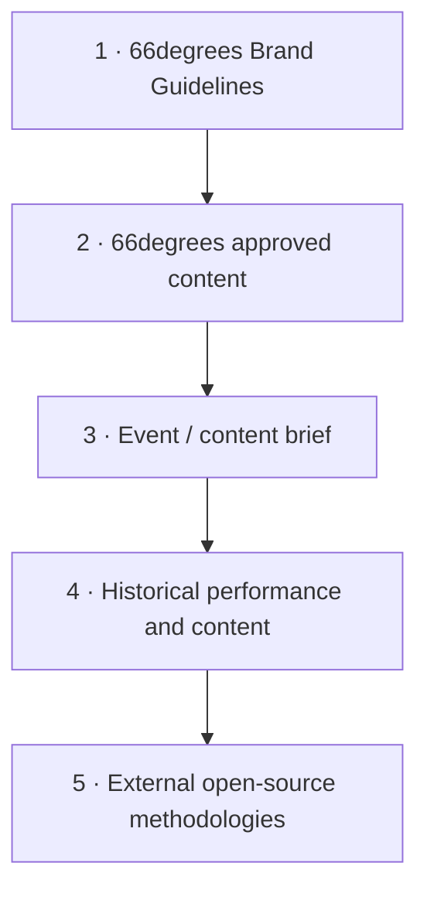
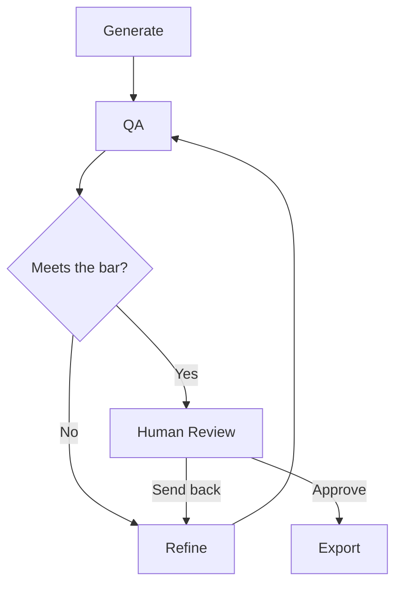

# 66degrees Content Marketing — AI Agent Plugin for Claude · ChatGPT · Gemini

> **From marketing brief to campaign-ready content — with AI doing the production work, governance and QA built in, and a human making the final call.**

An MCP-powered content marketing system for 66degrees. It connects strategy, event content, blog and white paper creation, optimization, repurposing, brand governance, QA, human approval, and export into a single governed workflow.

---

## Contents

- [What is this?](#what-is-this)
- [How it works](#-how-it-works)
- [Workflow at a glance](#-workflow-at-a-glance)
- [The 11 AI agents](#-11-ai-agents-working-behind-the-scenes)
- [Skills](#-skills)
- [Example prompts — explore the system](#-example-prompts--explore-the-system)
- [Built for 66degrees](#-built-for-66degrees)
- [Built with Ponytail principles](#-built-with-ponytail-principles)
- [Technology](#️-technology)
- [Requirements & installation](#-requirements--installation)
- [Environment configuration](#-environment-configuration)
- [Running tests](#-running-tests)
- [Starting MCP](#-starting-mcp)
- [Cursor Setup](#-cursor-setup)
- [Directory structure](#-directory-structure)
- [Development workflow](#-development-workflow)
- [Troubleshooting](#-troubleshooting)
- [Security](#-security)
- [Time savings](#️-approximate-time-savings)
- [Reference library](#-reference-library)
- [Human-in-the-loop](#-human-in-the-loop)
- [License](#license)

---

## What is this?

Most AI content workflows look like this:



This project works more like a **marketing production team**:



You give the system a marketing goal or event brief, and it turns that input into structured, campaign-ready content — keeping 66degrees messaging, quality checks, and human approval in the loop at every step. The same governed workflow sits behind each format it supports: **event content, blogs, and white papers**.

---

## 🔄 How it works

The workflow runs in five layers:

**1. Input** — A marketing goal, campaign brief, or event brief.

**2. Skills & MCP tools** — The system selects the capability the task needs: strategy, content creation, refinement, social, repurposing, optimization, QA, approval, or export.

**3. Core & technology** — Work is grounded in 66degrees brand rules, approved references, content-quality checks, originality checks, and specialist engines such as Emailens.

**4. QA & human review** — Content can **PASS**, raise a **WARNING**, or require a **REWRITE**. A human reviews the campaign before final export.

**5. Output** — An approved campaign kit, exportable to **DOCX, XLSX, or JSON**.

---

## 🗺️ Workflow at a glance

The full production flow, from brief to approved export, including the QA gate and the human approval loop:



*Every stage above maps to a real component in this repository.*

You can also view the illustrated version of the workflow:


---

## 🤖 11 AI agents working behind the scenes

Think of the system as **11 AI specialists working together**. You interact with the workflow naturally, while the specialist agents handle each stage in the background.



The goal is simple: **less time moving content between tools, more time on the ideas and decisions that matter.**

---

## 🧩 Skills

The system brings together everything needed to take a campaign from idea to approved output.

| Skill | What it does |
|---|---|
| **Strategy** | Turns marketing goals into a content strategy |
| **Event Intelligence** | Turns event information into a structured campaign brief |
| **Content Creation** | Creates campaign and content assets |
| **Refinement** | Improves content using feedback |
| **Social** | Turns source content into platform-specific social posts |
| **Repurposing** | Converts one asset into multiple formats |
| **Optimization** | Improves content using QA feedback |
| **Brand Governance** | Keeps content aligned with 66degrees messaging |
| **Quality Assurance** | Checks content before it moves forward |
| **Human Approval** | Keeps a person in control of the final campaign |
| **Export** | Turns approved work into usable campaign files |

---

## 💬 Example prompts — explore the system

You drive the whole system in plain language from Claude, ChatGPT, or Gemini. Below is a generous set of prompts you can copy, adapt, and chain together. Replace anything in `[brackets]` with your own campaign, event, or client details.

> **Tip:** You rarely need to name a tool. Describe what you want ("run QA on this", "export the approved kit as DOCX") and the system routes it to the right agent. The tool names are shown alongside each group only so you know what runs under the hood.

### 🚀 Getting started & discovery

```text
What can you do?
List every tool in this MCP and explain what each one does.
Walk me through your content workflow from brief to export.
What 66degrees brand rules and terminology do you enforce?
Which content formats do you support, and how does each one flow through QA?
Show me an example of turning an event brief into an approved campaign kit.
What does a PASS, a WARNING, and a REWRITE mean in your QA step?
```

### 🎯 Strategy · `generate_content_strategy`

```text
Create a content strategy for a 66degrees campaign targeting enterprise CTOs about migrating SecOps to Google Cloud.
Build a Q3 content strategy focused on Generative AI adoption for retail clients.
Draft a content strategy to promote our Google Cloud Premier Partner expertise to financial services buyers.
Give me a strategy with themes, formats, and channels for a 6-week white paper launch.
What content pillars should we lead with for a data modernization campaign?
```

### 🗓️ Event Intelligence · `process_event_brief`

```text
Here's our event brief — validate it and structure it into a campaign brief: [paste details].
Turn this event description into a structured brief and tell me what information is missing: [paste].
Process this webinar brief and flag any gaps in audience, goals, or key messages.
Structure the brief for "Engineering the Agentic Enterprise — Atlanta" and highlight the primary CTA.
```

### 📦 Campaign kit · `generate_campaign_kit`

```text
Generate a full campaign kit for our "Engineering the Agentic Enterprise — Atlanta" event.
Build a campaign kit for a white paper launch on Generative AI in financial services.
Create a campaign kit from this approved strategy, including blog, social, and email assets.
Generate a campaign kit for a Google Cloud SecOps webinar, targeting security leaders.
```

### ✍️ Content Creation · `generate_content_asset`

```text
Write a blog post on how 66degrees helps enterprises modernize SecOps with Google Cloud.
Draft a white paper introduction on agentic AI for the enterprise.
Create an event landing-page description for [event], leading with the customer outcome.
Write a promotional email for [campaign] aimed at IT decision-makers.
Draft a customer-success-style narrative highlighting a Generative AI deployment.
```

### 🔧 Refinement · `refine_content_asset`

```text
Refine this blog draft to sound more executive and less salesy: [paste].
Tighten this white paper section and remove forbidden jargon.
Rework this intro so it leads with the business outcome, not the technology.
Make this email shorter and add a clearer call to action.
Adjust the tone of this piece to match the 66degrees voice.
```

### 📣 Social · `generate_social_posts`

```text
Turn this blog post into 5 LinkedIn posts for 66degrees.
Create a LinkedIn post and an X thread promoting our Atlanta event.
Generate one social post per key finding from this white paper.
Write social copy for the campaign, tailored per platform, with suggested hashtags.
```

### ♻️ Repurposing · `repurpose_content_asset`

```text
Repurpose this white paper into a blog post and a 3-email nurture sequence.
Turn this webinar recap into a one-page summary and 3 social posts.
Convert this blog into an executive briefing and a LinkedIn carousel outline.
Repurpose this event recap into a follow-up email and a customer story.
```

### 📈 Optimization · `optimize_content_asset`

```text
Optimize this asset using the QA feedback.
Apply the QA suggestions and improve readability and brand alignment.
Improve this piece for clarity and messaging-hierarchy compliance, then show what changed.
Optimize this email for engagement while keeping it on-brand.
```

### 🔍 Quality Assurance & Brand Governance · `qa_validate_asset`

```text
Run QA on this blog post and tell me whether it passes.
Check this email for brand compliance and forbidden jargon.
Validate this asset against the 66degrees Messaging Foundation v17.
Does this copy use approved terminology like "Google Cloud Premier Partner", "Generative AI", and "SecOps" correctly?
Run originality and brand checks on this draft and summarize the issues.
```

### ✅ Human Approval · `approve_campaign_kit`

```text
Show me the campaign kit for review before approval.
Approve the Atlanta campaign kit.
Approve this kit with these notes: [your notes].
Which assets in this kit still need changes before I approve?
```

### 📤 Export · `export_campaign_kit`

```text
Export the approved campaign kit to DOCX.
Export this campaign as XLSX and JSON.
Give me the final approved kit as a downloadable document.
Export only the social assets from the approved kit.
```

### 📚 Reference library

```text
Find approved 66degrees references about SecOps.
Show me competitive advertising examples similar to this campaign angle.
What approved sources do you have for Google Cloud events?
Pull messaging patterns from past 66degrees success stories relevant to this brief.
```

### 🧭 End-to-end walkthroughs

Chain prompts to run a full campaign through the governed workflow.

**Event campaign**

```text
1. Process this event brief and structure it: [paste].
2. Create a content strategy from the structured brief.
3. Generate a campaign kit for the event.
4. Run QA on every asset and show me the results.
5. Optimize anything that raised a WARNING or REWRITE.
6. Show me the kit for approval.
7. Export the approved kit to DOCX and JSON.
```

**Blog post**

```text
1. Write a blog post on [topic] for [audience].
2. Run QA and check brand compliance.
3. Refine based on the QA feedback.
4. Repurpose the final post into 5 LinkedIn posts and a nurture email.
5. Approve and export everything to DOCX.
```

**White paper**

```text
1. Create a strategy for a white paper on [topic].
2. Generate the white paper as a content asset.
3. Validate it against the Messaging Foundation v17.
4. Optimize using the QA feedback.
5. Repurpose into a blog, an executive summary, and social posts.
6. Approve the kit and export to DOCX, XLSX, and JSON.
```

---

## 🧠 Built for 66degrees

This system is not built to generate generic marketing copy. It uses 66degrees brand and messaging guidance as part of the workflow, including:

- Voice and tone
- Messaging hierarchy
- Strategic pillars
- Approved terminology
- Brand governance
- Approved reference content

The current brand rules enforce terminology such as **Google Cloud Premier Partner**, **Generative AI**, and **SecOps**, while blocking defined forbidden jargon. The **66degrees Messaging Foundation v17** provides the canonical foundation for positioning and terminology.

---

## 🐴 Built with Ponytail principles

The engineering approach follows the **Ponytail** philosophy:

> Keep the implementation small. Reuse the standard library and existing dependencies where they already solve the problem. Don't add complexity without a reason.

Simplicity does **not** mean cutting corners — validation, error handling, security, and accessibility remain part of the implementation. This shows in the deliberately small public MCP surface: **11 tools**, with specialist strategies kept internal to the core.

---

## 🛠️ Technology

| Layer | Technology |
|---|---|
| Language | Python 3.12 |
| AI interface | MCP |
| Data validation | Pydantic |
| Reference storage | SQLite |
| Semantic retrieval | Optional ChromaDB / sentence-transformers |
| Web intelligence | HTTPX, BeautifulSoup, Playwright |
| Email QA | Emailens |
| Export | DOCX, XLSX, JSON |
| AI clients | Claude, ChatGPT, Gemini |
| Testing | pytest |

<details>
<summary><strong>The MCP tools behind the 11 AI agents</strong></summary>

| Tool | Purpose |
|---|---|
| `generate_content_strategy` | Generate a content strategy |
| `process_event_brief` | Validate and structure an event brief |
| `generate_campaign_kit` | Generate a campaign kit |
| `generate_content_asset` | Generate a content asset |
| `refine_content_asset` | Refine an existing asset |
| `generate_social_posts` | Generate social posts |
| `repurpose_content_asset` | Repurpose an existing asset |
| `optimize_content_asset` | Optimize content using QA feedback |
| `qa_validate_asset` | Run content QA |
| `approve_campaign_kit` | Apply the human approval gate |
| `export_campaign_kit` | Export an approved campaign kit |

These are the technical interfaces behind the 11 AI agents; specialist strategies remain internal implementation components.

</details>

---

## 📦 Requirements & installation

- **Python 3.12** (see `.python-version`)
- **[uv](https://docs.astral.sh/uv/)** for locked dependency installs
- Optional LLM provider keys only when not using `LLM_PROVIDER=mock`

```bash
git clone https://github.com/eneelkant/66degrees-content-marketing.git
cd 66degrees-content-marketing
./scripts/setup.sh
```

`setup.sh` syncs dependencies from `uv.lock`, creates `.env` from `.env.example` if missing, and validates imports.

Manual equivalent:

```bash
uv sync --group dev
cp -n .env.example .env
PYTHONPATH=. uv run python -c "from clients.claude.server import mcp; print('ok')"
```

---

## 🔐 Environment configuration

Copy `.env.example` → `.env`. Grouped variables:

| Group | Variables | Notes |
|---|---|---|
| Runtime | `ENVIRONMENT`, `LOG_LEVEL`, `DATA_DIR`, `REFERENCES_DB_PATH` | Defaults work for local/dev |
| LLM | `LLM_PROVIDER`, `ANTHROPIC_*`, `OPENAI_*`, `GEMINI_*` | Prefer `LLM_PROVIDER=mock` for tests/CI |
| MCP | `MCP_AUTH_TOKEN`, `MCP_API_KEY`, `CORS_ALLOWED_ORIGINS` | Required for **remote** HTTP MCP |
| Optional | Provider model overrides | No Salesforce/GitHub secrets required for the default suite |

Missing provider keys raise **actionable** errors (e.g. “Set `GEMINI_API_KEY` in `.env`…”) instead of opaque SDK failures.

---

## 🧪 Running tests

```bash
./scripts/check.sh    # imports + MCP tool discovery
./scripts/test.sh     # pytest with LLM_PROVIDER=mock
```

Tests are deterministic: mocked LLMs, seeded reference fixtures, no paid API calls.

CI: `.github/workflows/ci.yml` runs the same check + test path on pull requests.

---

## 🔌 Starting MCP

```bash
./scripts/run-mcp.sh          # stdio (Claude Desktop / Cursor local)
./scripts/run-mcp.sh http     # Streamable HTTP on 127.0.0.1:8000
./scripts/run-mcp.sh sse      # legacy SSE transport
```

Or:

```bash
uv run python -m clients.claude.server
uv run degrees-mcp
```

Example Claude Desktop / Cursor MCP config: `config/claude_desktop_config.example.json`.

---

## 🖥️ Cursor Setup

1. Clone this repository and open the folder in **Cursor**.
2. Run `./scripts/setup.sh` in the integrated terminal.
3. Confirm `./scripts/check.sh` and `./scripts/test.sh` pass.
4. Read `.cursor/AGENTS.md` — the agent operating manual.
5. Project rules under `.cursor/rules/` apply automatically for architecture, Python, MCP, testing, security, and brand governance.
6. Reusable agent tasks live in `.cursor/tasks/` (health check, add tool, generate campaign, security audit, …).
7. Start Agent mode and ask for a task (e.g. “run repository-health-check” or “generate a mocked campaign kit”).
8. For MCP inside Cursor, point an MCP server entry at `uv run --directory <repo> python -m clients.claude.server` (see `config/claude_desktop_config.example.json`).

Keep `LLM_PROVIDER=mock` unless you intentionally want live provider calls.

---

## 📁 Directory structure

```text
clients/          # MCP adapters (Claude, ChatGPT, Gemini) + public_api
config/           # settings, logging, example MCP client config
core/             # brand, QA, approval, generators, LLM, references, security
engines/          # specialist engines (e.g. Emailens)
exporters/        # approved kit export (JSON / DOCX / XLSX)
mcp/              # auth re-export + notes (not a Python package — avoids SDK shadowing)
references/       # Messaging Foundation + refresh metadata (*.db gitignored)
scripts/          # setup, check, test, run-mcp, refresh_references
tests/            # unit + e2e mocked journey + MCP smoke
.cursor/          # AGENTS.md, rules/, tasks/
.github/workflows # CI + reference refresh
```

---

## 🛠️ Development workflow

```bash
./scripts/setup.sh
./scripts/check.sh
./scripts/test.sh
# make a focused change
./scripts/test.sh -k <pattern>
```

Agent expectations: small testable diffs, no secret commits, preserve the 11-tool public surface unless explicitly expanding it, never bypass human approval to “make export work.”

---

## 🧯 Troubleshooting

| Symptom | Fix |
|---|---|
| `uv: command not found` | Install uv, then re-run `./scripts/setup.sh` |
| Wrong Python version | Use 3.12; `uv` reads `.python-version` |
| Tests fail looking up Google Cloud events | Expected on empty `references.db`; suite seeds fixtures — pull latest tests |
| Live LLM errors | Set `LLM_PROVIDER=mock` or set the matching `*_API_KEY` |
| Remote MCP 401 | Set `MCP_AUTH_TOKEN` or `MCP_API_KEY` |
| Export `PermissionError` | Call `approve_campaign_kit` first — intentional gate |
| `from mcp.server…` import fails | Do **not** add `mcp/__init__.py` (would shadow the SDK) |

---

## 🔒 Security

- Never commit `.env` or real API keys (see `.gitignore`).
- Use `.env.example` as the template.
- Logging redacts sensitive keys via `config/logging.py`.
- Untrusted tool payloads are sanitized in `core/security/input.py`.
- Remote MCP must not use wildcard CORS in production (`Settings.validate_production_security`).

---

## ⏱️ Approximate time savings

A typical content workflow involves research, outlining, drafting, editing, brand checks, repurposing, QA, and formatting. Bringing those steps into one workflow removes a large amount of repetitive production work.

**Illustrative target:** a task that might take **4–6 hours manually** can be reduced to roughly **1–2 hours of human effort**, depending on the asset, research depth, and review required.



*Illustrative estimate — actual savings vary by content type, complexity, and human review.*

---

## 📚 Reference library

The reference library gives the system controlled context instead of relying on generic knowledge alone.

It is designed to hold approximately **2,000+ competitive advertising examples** alongside approved 66degrees and Google Cloud references. Content is stored in **SQLite** so the AI agents can search for relevant examples and messaging patterns before creating content.

The competitive/reference collection is designed to refresh approximately every **7 days**, while the approved reference sources currently refresh every **2 days**.

Sources are prioritized in this order:



Approved reference sources currently include 66degrees events, 66degrees success stories, and Google Cloud events.

---

## 👤 Human-in-the-loop

AI does the production work. Automated QA checks the result. A human makes the final decision.



---

## License

This project is **for the 66degrees team only** and is not intended for external use or redistribution.
