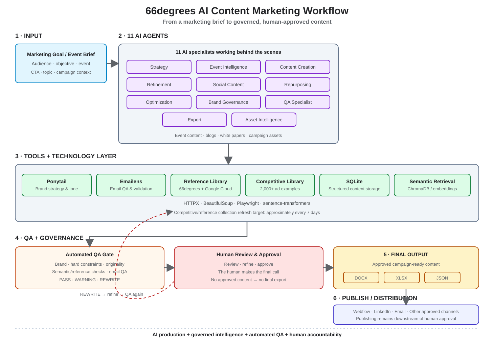

# 66degrees Content Marketing AI Agent

> **From marketing brief to campaign-ready content — with AI doing the production work, built-in governance and QA, and a human making the final call.**

An MCP-powered content marketing system for 66degrees.

It connects strategy, content creation, optimization, repurposing, brand governance, QA, human approval, and export into one workflow.

---

## What is this?

Most AI content workflows look like this:

**Prompt → AI → Copy**

This project is designed to work more like a **marketing production team**:

**Brief → Strategy → Create → Check → Improve → Approve → Export**

You give the system a marketing goal or event brief.

It helps turn that input into structured, campaign-ready content while keeping 66degrees messaging, quality checks, and human approval in the workflow.

---

## 🔄 How it works

The workflow has five simple layers:

**1. Input**  
A marketing goal, campaign brief, or event brief.

**2. Skills & MCP tools**  
The system decides which capability is needed — strategy, content creation, refinement, social, repurposing, optimization, QA, approval, or export.

**3. Core & technology**  
The work is grounded in 66degrees brand rules, approved references, content-quality checks, originality checks, and specialist engines such as Emailens.

**4. QA & human review**  
Content can **PASS**, raise a **WARNING**, or require a **REWRITE**. A human reviews the campaign before final export.

**5. Final output**  
An approved campaign kit that can be exported to **DOCX, XLSX, or JSON**.



*Illustration of the workflow — every tool and technology layer shown represents a real component in this repository.*

---

## 🧩 Skills

The system brings together the capabilities needed to take a campaign from idea to approved output.

| Skill | What it does |
|---|---|
| **Strategy** | Turns marketing goals into a content strategy |
| **Event Intelligence** | Turns event information into a structured campaign brief |
| **Content Creation** | Creates campaign and content assets |
| **Refinement** | Improves content using feedback |
| **Social** | Turns source content into platform-specific social posts |
| **Repurposing** | Converts one asset into multiple formats |
| **Optimization** | Improves content using QA feedback |
| **Brand Governance** | Keeps content aligned with 66degrees messaging |
| **Quality Assurance** | Checks content before it moves forward |
| **Human Approval** | Keeps a person in control of the final campaign |
| **Export** | Turns approved work into usable campaign files |

---

## 🧠 Built for 66degrees

The system is not designed to generate generic marketing copy.

It uses 66degrees brand and messaging guidance as part of the workflow, including:

- Voice and tone
- Messaging hierarchy
- Strategic pillars
- Approved terminology
- Brand governance
- Approved reference content

The current brand rules enforce terminology such as **Google Cloud Premier Partner**, **Generative AI**, and **SecOps**, while blocking defined forbidden jargon.

The **66degrees Messaging Foundation v17** provides the canonical messaging foundation for positioning and terminology.

---

## 🐴 Built with Ponytail principles

The engineering approach follows the philosophy of **Ponytail**:

> Keep the implementation small. Reuse the standard library and existing dependencies where they already solve the problem. Don't add complexity without a reason.

But simplicity does **not** mean cutting corners.

Validation, error handling, security, and accessibility remain part of the implementation.

This philosophy is reflected in the deliberately small public MCP surface: **11 tools**, with specialist strategies kept internal to the core.

---

## 🛠️ Technology

| Layer | Technology |
|---|---|
| Language | Python 3.12 |
| AI interface | MCP |
| Data validation | Pydantic |
| Reference storage | SQLite |
| Semantic retrieval | Optional ChromaDB / sentence-transformers |
| Web intelligence | HTTPX, BeautifulSoup, Playwright |
| Email QA | Emailens |
| Export | DOCX, XLSX, JSON |
| AI clients | Claude, ChatGPT, Gemini |
| Testing | pytest |

---

<details>
<summary><strong>🔧 The 11 public MCP tools</strong></summary>

| Tool | Purpose |
|---|---|
| `generate_content_strategy` | Generate a content strategy |
| `process_event_brief` | Validate and structure an event brief |
| `generate_campaign_kit` | Generate a campaign kit |
| `generate_content_asset` | Generate a content asset |
| `refine_content_asset` | Refine an existing asset |
| `generate_social_posts` | Generate social posts |
| `repurpose_content_asset` | Repurpose an existing asset |
| `optimize_content_asset` | Optimize content using QA feedback |
| `qa_validate_asset` | Run content QA |
| `approve_campaign_kit` | Apply the human approval gate |
| `export_campaign_kit` | Export an approved campaign kit |

Specialist strategies are internal implementation components and are intentionally not exposed as additional MCP tools.

</details>

---

## 📚 Reference library

The reference library gives the system controlled context instead of relying on generic knowledge alone.

Sources are prioritized in this order:

1. 66degrees Brand Guidelines
2. 66degrees approved content
3. Event / Content brief
4. Historical performance and content
5. External open-source methodologies

Approved reference sources currently include 66degrees events, 66degrees success stories, and Google Cloud events.

The library is designed to refresh every **2 days**.

---

## 👤 Human-in-the-loop

AI does the production work.

Automated QA checks the result.

A human makes the final decision.

```text
Generate
   ↓
QA
   ↓
Refine if needed
   ↓
Human Review
   ↓
Approve
   ↓
Export
