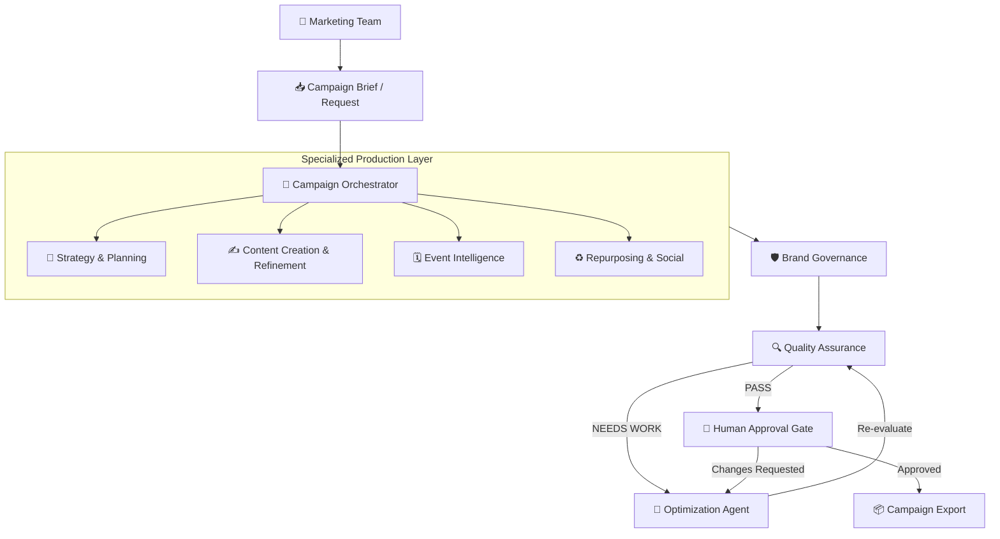
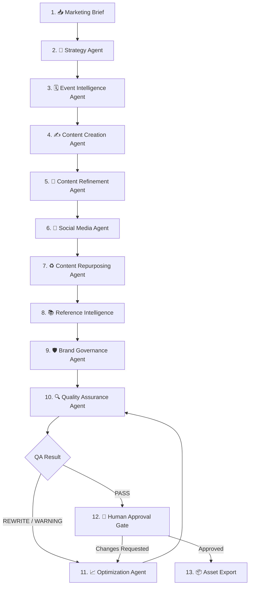
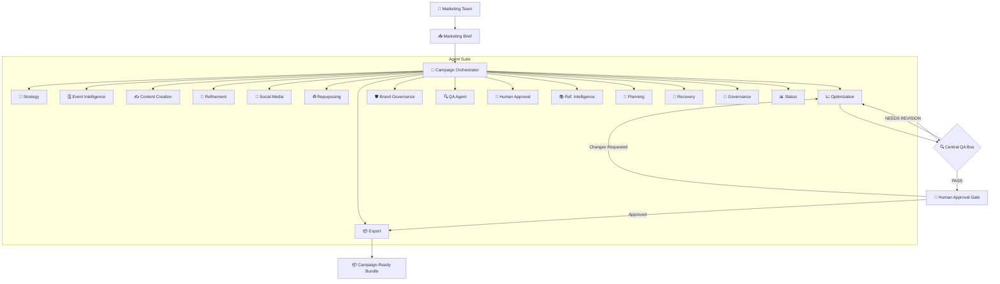
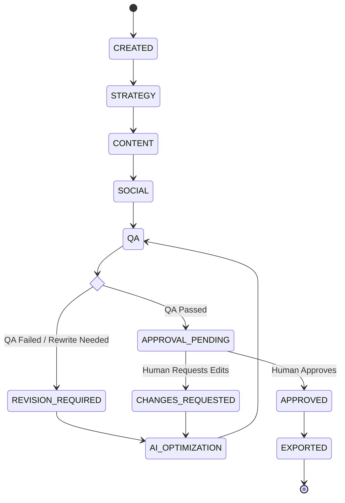
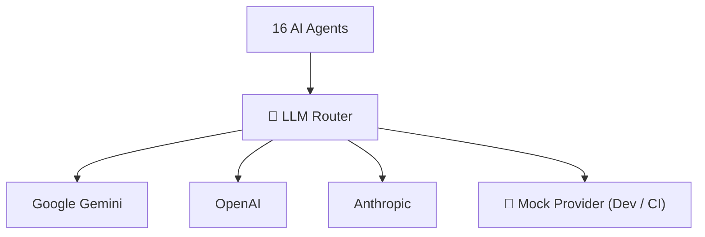
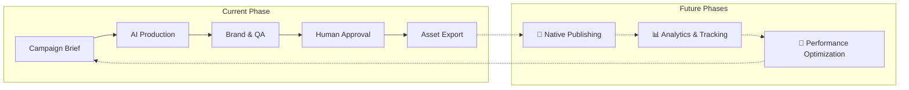

# 66degrees AI Marketing Automation Platform

[](#) [](#-testing--reliability) [](#) [](#-internal-project)

The **66degrees AI Marketing Automation Platform** is an enterprise-grade AI system engineered to automate repetitive campaign production while keeping human marketers strictly in control of strategic decisions and final execution approvals.

Rather than relying on a single monolithic model, the platform delegates work across **16 specialized AI Agents** coordinated by a central **Campaign Orchestrator** to plan, generate, validate, optimize, and export end-to-end marketing assets.

---

## 📌 Executive Architecture Overview



---

## 🤖 Specialized AI Agents

The platform deploys **16 specialized AI agents**, each constrained to a distinct lifecycle responsibility:

| # | Agent | Primary Responsibility |
|---|---|---|
| 1 | **Strategy Agent** | Formulates audience direction, messaging frameworks, themes, and content plans. |
| 2 | **Event Intelligence Agent** | Parses event metadata into structured campaign requirements. |
| 3 | **Content Creation Agent** | Authors core marketing collateral and initial asset drafts. |
| 4 | **Content Refinement Agent** | Polishes and adjusts existing copy based on operational feedback. |
| 5 | **Social Media Agent** | Extracts short-form, channel-specific social copy from core assets. |
| 6 | **Content Repurposing Agent** | Converts core assets into varied formats, such as ebooks into blog posts. |
| 7 | **Optimization Agent** | Automatically addresses QA failures and applies targeted revisions. |
| 8 | **Brand Governance Agent** | Enforces 66degrees style rules, forbidden terms, and tone standards. |
| 9 | **Quality Assurance Agent** | Validates technical completeness, formatting, and prompt fidelity. |
| 10 | **Human Approval Agent** | Enforces governance gates before final release. |
| 11 | **Export Agent** | Packages, formats, and delivers finalized campaign bundles. |
| 12 | **Reference Intelligence Agent** | Fetches and indexes context from internal knowledge repositories. |
| 13 | **Campaign Planning Agent** | Structures overarching objectives, timelines, and execution constraints. |
| 14 | **Campaign Recovery Agent** | Restores state and resumes execution following system interruptions. |
| 15 | **Campaign Governance Agent** | Enforces workflow boundary conditions and legal/compliance boundaries. |
| 16 | **Campaign Status Agent** | Tracks telemetry, state progression, and health logs. |

> **Note:** The **Campaign Orchestrator** manages agent sequencing, state transitions, state persistence, error handling, and recovery.

---

## 🔄 End-to-End Campaign Workflow

The workflow enforces a strict linear lifecycle with built-in revision loops:



---

## 🏗️ Technical Architecture & Agent Interconnection



---

## 🔌 Model Context Protocol (MCP) Tools

The platform exposes **16 secure MCP tools** allowing AI assistants such as Cursor and Claude Desktop to programmatically trigger and manage operations:

```text
• create_campaign          • generate_social
• approve_campaign         • get_campaign_status
• repurpose_content        • export_campaign
• resume_campaign          • run_qa_check
• fetch_reference_data     • generate_strategy
• check_brand_governance   • track_telemetry
• generate_content         • optimize_content
• recover_state            • refine_content
```

---

## 🔄 Campaign State Machine & Revision Loop

Campaigns maintain deterministic state persistence. Direct bypassing of approval states is programmatically blocked at the system layer.



### 🔐 Governance Constraints & Recovery

- **Idempotent Execution:** Critical operations (`create_campaign`, `approve_campaign`, `export_campaign`) are safe to retry without duplicate side effects.
- **Persistent Recovery:** State checkpoints allow interrupted runs to resume seamlessly via `resume_campaign` without resetting stable Campaign IDs.
- **Hard Approvals:** The platform strictly prevents invalid transitions such as `QA_FAILED → APPROVED` or `APPROVAL_PENDING → EXPORTED`.

---

## 📊 Version Transformation Summary

| Capability | Legacy Baseline | Current Platform State |
|---|---|---|
| **Specialized AI Agents** | Limited specialist tools | **16 Coordinated Agents** |
| **MCP Integration** | 11 Basic Tools | **16 Managed Production Tools** |
| **Orchestration & State** | Stateless Execution (Ephemeral) | **Persistent Campaign State Machine** |
| **Execution Recovery** | ❌ No Recovery | **✅ Idempotent State Recovery** |
| **CI / Automated Testing** | Limited Tests (~43) | **✅ 75 Passing Integration Tests** |
| **IDE Integration** | Manual Prompting | **✅ Full Cursor Agent Configuration** |
| **Provider Support** | Hardcoded AI Provider | **✅ Pluggable Router (Gemini, OpenAI, Anthropic, Mock)** |

---

## 🧠 AI LLM Routing Architecture

The core runtime uses an abstracted provider layer to allow dynamic model selection and cost-safe local development:



---

## 📂 Repository Layout

```text
66degrees-content-marketing/
├── .cursor/                # Cursor Agent instructions, rules, and task files
│   ├── AGENTS.md
│   ├── rules/
│   └── tasks/
├── .github/                # CI/CD Workflows (GitHub Actions)
│   └── workflows/
├── clients/                # Client adapters (ChatGPT, Claude, Gemini, Public API)
├── config/                 # System and environment configurations
├── core/                   # Core business logic
│   ├── brand/              # Governance and style checking logic
│   ├── campaign/           # Orchestrator and state machine implementation
│   ├── llm/                # Provider abstraction layer
│   └── qa/                 # Rule-based and model-assisted quality checking
├── docs/                   # Comprehensive technical documentation
├── mcp/                    # Model Context Protocol servers and tool definitions
├── references/             # Reference datasets (excluded from git)
├── scripts/                # Shell automation scripts (setup, test, build)
├── tests/                  # Test suites (75 passing unit/integration tests)
├── .env.example            # Environment setup template
├── pyproject.toml          # Python project definitions and dependencies
└── README.md
```

---

## ⚙️ Quickstart & Local Development

### 1. Installation

```bash
# Clone the repository
git clone https://github.com/eneelkant/66degrees-content-marketing.git
cd 66degrees-content-marketing

# Run automated environment setup
./scripts/setup.sh
```

### 2. Run Verification Checks

```bash
# Code formatting, linting, and static checks
./scripts/check.sh

# Run test suite
./scripts/test.sh
```

### 3. Launch MCP Server

```bash
# Start local MCP service
./scripts/run-mcp.sh
```

> **Safe Testing Mode:** By default, local environments use `LLM_PROVIDER=mock`. This allows end-to-end testing of workflows, agent routing, and orchestration without consuming API credits.

---

## 📚 Technical Documentation

Detailed guides are maintained in the [`/docs`](./docs) directory:

| Document | Description |
|---|---|
| [`docs/AGENT_ARCHITECTURE.md`](./docs/AGENT_ARCHITECTURE.md) | Agent specifications, memory structures, and orchestration parameters. |
| [`docs/MCP_TOOL_CATALOG.md`](./docs/MCP_TOOL_CATALOG.md) | Exhaustive list of available tools, schemas, and usage examples. |
| [`docs/CONTENT_TYPES.md`](./docs/CONTENT_TYPES.md) | Specifications for supported collateral types and formatting constraints. |
| [`docs/CURSOR_AUTOMATION.md`](./docs/CURSOR_AUTOMATION.md) | Standard Operating Procedures (SOP) for running tasks via Cursor Agent. |
| [`docs/PRODUCTION_WORKFLOW.md`](./docs/PRODUCTION_WORKFLOW.md) | End-to-end production guide and deployment requirements. |

---

## 🗺️ Product Roadmap



### Planned Integrations

- **CRM / Marketing Automation:** Salesforce, Account Engagement (Pardot)
- **Cloud AI Infrastructure:** Google Cloud Vertex AI, BigQuery
- **Analytics & Social:** Google Analytics, LinkedIn API
- **Workflow Automation:** n8n, Jira, Email Delivery Platforms

---

## 🔒 Security & Governance

This repository is strictly intended for internal development at **66degrees**.

- **Secrets Management:** Never commit API credentials, environment variables, or private brand parameters. Use `.env` or enterprise secret stores.
- **Human Oversight:** The platform is engineered around human control. Automated tools accelerate content generation, but final release authority remains exclusively with human marketers.

---

*© 66degrees. Internal Use Only.*
