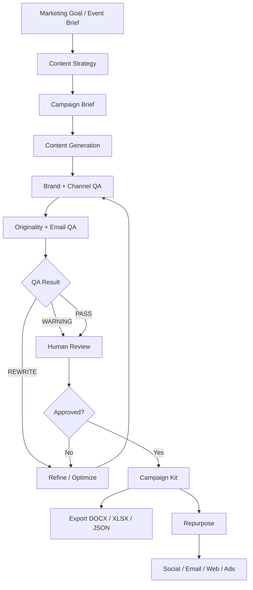
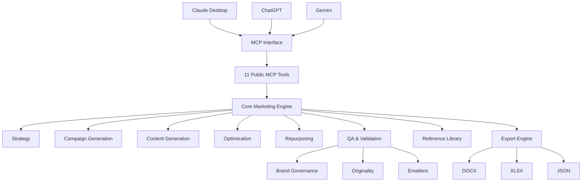

````markdown
# 66degrees Content Marketing AI Agent

> An MCP-powered AI content marketing system for 66degrees — from campaign strategy and event briefs to content generation, QA, approval, and export.

## 🚀 Quick Setup — Start Here

This project exposes a controlled content-marketing workflow through MCP so AI clients such as Claude Desktop, ChatGPT, and Gemini can use the same governed content-generation system.
````
### 1. Clone the repository

```bash
git clone https://github.com/eneelkant/66degrees-content-marketing.git
cd 66degrees-content-marketing
```

### 2. Install dependencies

Using `uv`:

```bash
uv sync
```

Or using pip:

```bash
pip install -e .
```

### 3. Configure environment variables

Create a local `.env` file:

```bash
cp .env.example .env
```

Configure the required environment variables for your environment.

**Never commit API keys, credentials, service-account files, or other secrets.**

### 4. Run the MCP server

For Claude Desktop, the MCP server can be started with:

```bash
uv run python clients/claude/server.py
```

See the client configuration examples in:

```text
config/
clients/claude/
clients/chatgpt/
clients/gemini/
```

---

## 🤖 The AI Agent

The 66degrees Content Marketing AI Agent provides a governed workflow for turning marketing goals and event briefs into campaign-ready content.

The agent can:

* Develop content strategy
* Process event briefs
* Generate campaign kits
* Generate individual content assets
* Refine and improve content
* Repurpose content across formats
* Generate social posts
* Run brand and channel QA
* Check originality
* Audit email HTML with Emailens
* Require human approval before export
* Export campaign assets to DOCX, XLSX, and JSON

The architecture separates the **core marketing logic** from individual AI clients.

This means the same governed workflow can be used from different AI interfaces without duplicating the business logic.

---

## 🔄 Campaign Workflow



---

## 🏗️ Architecture



### Design principle

AI clients are adapters.

The core system owns:

* Content strategy
* Content generation
* Brand governance
* Reference retrieval
* Validation
* Optimization
* Repurposing
* Approval gates
* Export

This prevents client-specific logic from becoming duplicated across Claude, ChatGPT, and Gemini implementations.

---

# 🧰 Public MCP Tools

The MCP interface exposes exactly **11 public tools**.

| Tool                        | Purpose                                                |
| --------------------------- | ------------------------------------------------------ |
| `generate_content_strategy` | Generate a content strategy from marketing goals       |
| `process_event_brief`       | Convert an event brief into structured campaign inputs |
| `generate_campaign_kit`     | Generate a complete campaign kit                       |
| `generate_content_asset`    | Generate a specific content asset                      |
| `refine_content_asset`      | Refine an existing asset using feedback                |
| `generate_social_posts`     | Generate social posts from source content              |
| `repurpose_content_asset`   | Repurpose content into target formats                  |
| `optimize_content_asset`    | Optimize content using QA feedback                     |
| `qa_validate_asset`         | Validate content against governance and QA rules       |
| `approve_campaign_kit`      | Approve a campaign kit for export                      |
| `export_campaign_kit`       | Export an approved campaign kit                        |

Specialist generation strategies remain internal to the core system and are not exposed as additional MCP tools.

---

# 📣 Campaign & Event

The system supports campaign development across:

* Event Brief
* Email
* Landing Pages
* Google Ads
* LinkedIn Ads

A campaign can begin with a structured event brief or broader marketing goal and progress through strategy, generation, QA, approval, and export.

---

# ✍️ Content

Supported content categories include:

* Website
* Blog
* Case Studies
* Thought Leadership
* Newsletter
* Social
* Video Scripts
* Whitepapers

Content can also be:

* Rewritten
* Improved
* Optimized
* Repurposed
* Validated
* Exported

---

# 🧠 Brand Governance

Brand governance is built into the generation and QA workflow.

The system uses:

* 66degrees Brand Identity & Governance Guidelines
* 66degrees Messaging Foundation
* Approved reference content
* Controlled terminology
* Voice and tone rules
* Messaging hierarchy
* Proof-library rules
* Human approval gates

The **66degrees Messaging Foundation v17** is treated as the canonical messaging source for positioning, terminology, voice, and approved copy.

It distinguishes between:

* **COPY** — approved language that should be preserved
* **DIRECTION** — guidance for developing new content

The system should not silently rewrite canonical messaging.

---

# 🎯 Messaging Foundation

The current messaging foundation establishes:

### Core narrative

**Engineering Your AI-Native Advantage**

### Mission

**To turn AI ambition into an operating reality.**

### Core promise

**Transforming Complexity into Clarity.**

### Named outcome

**AI-Native Enterprise**

### Operating system

**AgenticOS**

### Delivery platform

**Paradigm°**

### Engagement platform

**ParadigmOS**

### Foundation layer

**Paradigm Data**

The system maintains the distinction between:

* **AI-native** — describes the company or outcome
* **agentic** — describes the machinery and systems enabling that outcome

---

# 🛡️ QA & Governance

Generated content passes through structured validation before it can be exported.

QA includes:

* Required-field validation
* Content-type validation
* Brand-rule validation
* Terminology validation
* Originality checks
* Email HTML auditing
* Channel-specific checks
* Human approval

QA can produce:

```text
PASS
WARNING
REWRITE
```

Content requiring rewriting can be sent back through the refinement and optimization workflow.

---

# 📧 Emailens

Email content can be audited using the Emailens engine.

The workflow is:

```text
Generate
   ↓
Emailens Audit
   ↓
Analyze
   ↓
Rewrite if Required
   ↓
Re-audit
```

Emailens provides local/offline-first email analysis including areas such as:

* Compatibility
* Spam risk
* Accessibility
* Email size
* HTML quality

Domain-level SPF, DKIM, and DMARC validation is treated separately from the local Emailens content audit.

Install the optional QA dependencies as required by the project configuration.

---

# 📚 Reference Library

The reference library provides controlled context for content generation.

The library supports:

* Internal approved content
* Historical winning content
* Event and campaign references
* External methodology references
* Platform-specific references
* Authority metadata
* Source URLs
* Version tracking
* Refresh tracking

### Source hierarchy

1. 66degrees Brand Guidelines
2. 66degrees approved content
3. Event / Content brief
4. Historical performance and content
5. External open-source methodologies

Internal company knowledge is kept distinct from external methodology.

Reference data is designed to refresh periodically, with a **45-day freshness gate**.

---

# 📊 Platform Intelligence

Historical campaign performance can be used as reference context for content generation.

Supported channel references include:

### Google Ads

Examples of historical high-performing themes include:

* Looker Conversational Analytics
* Google Agentspace
* Agentic AI
* Enterprise AI
* Brand searches

### LinkedIn

Historical reference campaigns include:

* Regional promotions
* Google Cloud Next events
* Agentic Enterprise campaigns
* AI-focused events and registrations

Performance data is used as reference context rather than as an automatic guarantee of future performance.

---

# 🔁 Optimization & Repurposing

The system can transform existing content into new formats while maintaining the underlying messaging.

Example:

```text
Whitepaper
   ↓
Blog
   ↓
LinkedIn Posts
   ↓
Email
   ↓
Landing Page
   ↓
Video Script
```

Optimization can incorporate:

* QA feedback
* Channel requirements
* Brand rules
* Messaging constraints
* Audience considerations

---

# 👤 Human-in-the-Loop

Human approval is intentionally part of the workflow.

The system does not treat generated content as automatically publishable.

The intended flow is:

```text
AI Generation
     ↓
Automated QA
     ↓
Human Review
     ↓
Approval
     ↓
Export
```

Export is blocked until the campaign kit reaches the required approval state.

This provides a controlled balance between automation and human governance.

---

# 📦 Export

Approved campaign kits can be exported as:

* DOCX
* XLSX
* JSON

Exports are generated from structured campaign data rather than from client-specific AI responses.

---

# 🔌 Multi-Client Support

The project is designed to work across multiple AI clients.

## Claude Desktop

Claude Desktop can connect directly to the MCP server.

Example configuration:

```text
config/claude_desktop_config.example.json
```

## ChatGPT

ChatGPT integration includes:

* Streamable HTTP MCP support
* SSE support
* OpenAI Agents SDK adapter
* Client adapter layer

Relevant files:

```text
clients/chatgpt/
```

## Gemini

Gemini integration includes:

* Google GenAI-compatible declarations
* Gemini client adapter
* Gemini CLI configuration

Relevant files:

```text
clients/gemini/
```

---

# 🔐 Security

Security controls include:

* Environment-based configuration
* Secret sanitization
* Bearer/API-key validation
* HTTP authentication middleware
* CORS controls
* Input sanitization
* `.gitignore` protection for credentials
* No committed API keys or service-account credentials

Never commit:

```text
.env
*.key
*.pem
credentials.json
google-ads-mcp.json
```

---

# 🗂️ Project Structure

```text
66degrees-content-marketing/
├── core/
│   ├── event_brief/
│   ├── content_brief/
│   ├── generators/
│   ├── validation/
│   ├── brand/
│   └── reference_library/
│
├── engines/
│   ├── emailens/
│   ├── originality/
│   ├── google_ads/
│   └── content_quality/
│
├── mcp/
│   ├── server.py
│   └── tools.py
│
├── clients/
│   ├── claude/
│   ├── chatgpt/
│   └── gemini/
│
├── references/
├── config/
├── exporters/
├── tests/
├── pyproject.toml
└── README.md
```

---

# 🧪 Testing

The project includes automated tests covering:

* Core generation
* Structured outputs
* Brand validation
* Reference retrieval
* QA
* Optimization
* Repurposing
* Export
* MCP tools
* Multi-client adapters
* Security
* End-to-end campaign workflows

Run the test suite with:

```bash
uv run pytest
```

---

# ⚙️ Configuration

Project configuration is managed through environment variables and the configuration layer.

Primary configuration files include:

```text
config/settings.py
config/logging.py
```

Use `.env` for local development.

Do not commit production credentials.

---

# 🏛️ Core Design Principles

### 1. Structured outputs

Core functions return structured Pydantic models and JSON-compatible data.

### 2. Client independence

Claude, ChatGPT, and Gemini are adapters around the same core marketing system.

### 3. Governed generation

Content generation is constrained by brand, messaging, channel, and QA rules.

### 4. Human approval

Automation does not remove the human approval gate.

### 5. Reference-driven intelligence

Approved internal references and controlled external methodologies provide generation context.

### 6. Reusable content

Content can be optimized and repurposed rather than regenerated from scratch.

### 7. Export-ready workflows

Approved campaign kits can be converted into operational marketing deliverables.

---

# 🚦 Project Status

The current implementation includes:

* ✅ Repository architecture
* ✅ Event brief processing
* ✅ Content generation
* ✅ Campaign kit generation
* ✅ Google Ads content
* ✅ LinkedIn content
* ✅ Email lifecycle content
* ✅ Social generation
* ✅ Content optimization
* ✅ Content repurposing
* ✅ Brand governance
* ✅ Reference library
* ✅ Originality validation
* ✅ Emailens integration
* ✅ Human approval gate
* ✅ DOCX / XLSX / JSON export
* ✅ Claude MCP integration
* ✅ ChatGPT integration
* ✅ Gemini integration
* ✅ Authentication and security controls
* ✅ Automated testing
* ✅ Reference refresh workflow

---

# 📄 License

This repository is intended for the 66degrees content marketing AI workflow and associated development purposes.

```

**For GitHub:** replace the entire contents of `README.md` with the block above, then click **Commit changes**.

One correction to my earlier approach: **don't run terminal commands for this update.** Since you want to edit the GitHub repository directly, the GitHub editor is sufficient.
```
