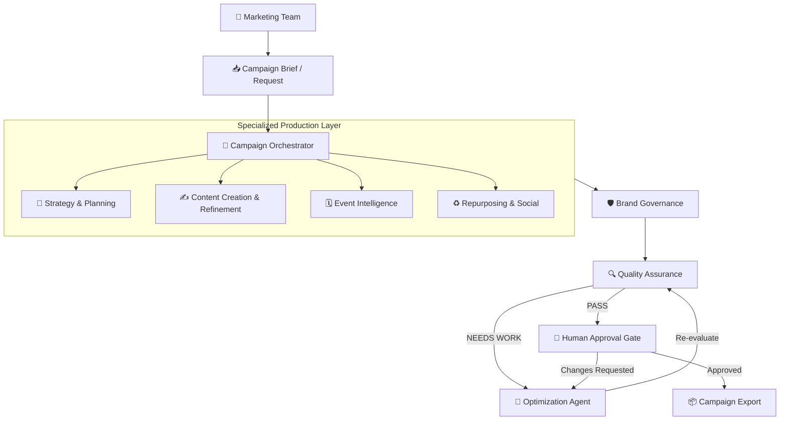
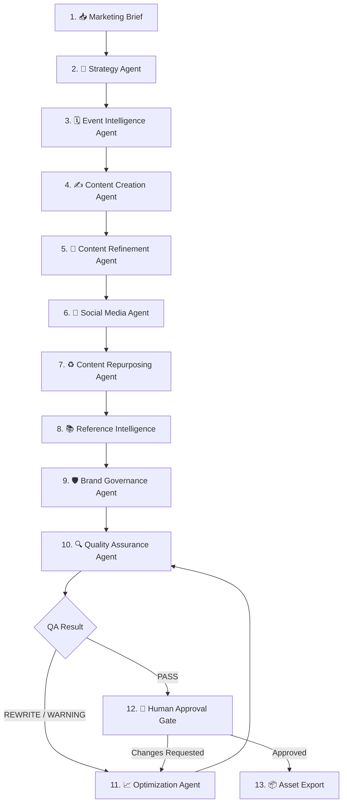
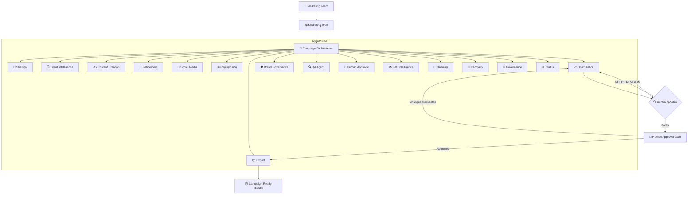
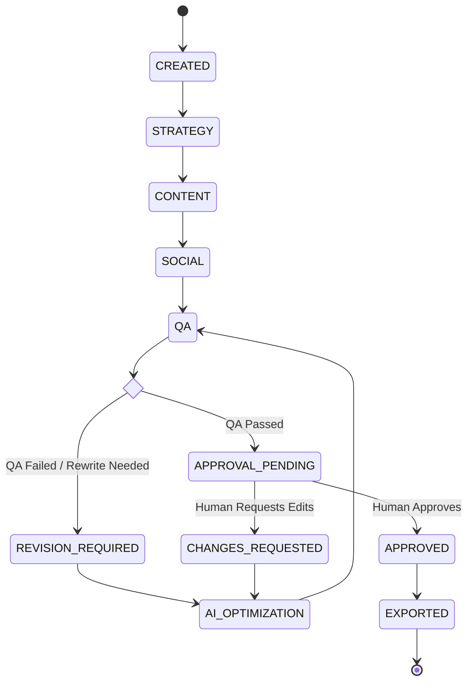
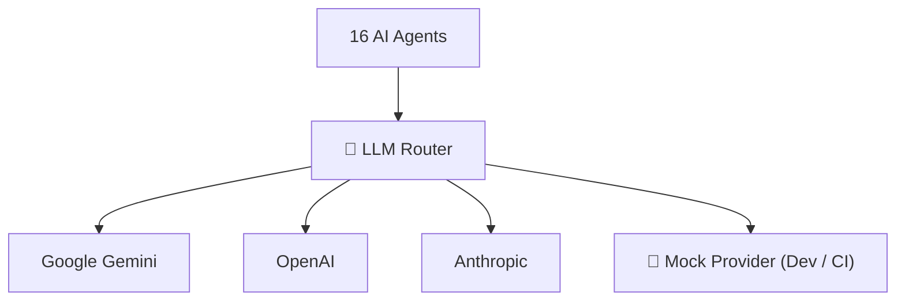
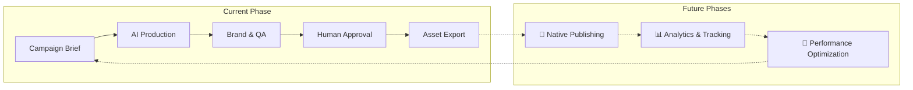

# 66degrees AI Marketing Automation Platform

[](#) [](#-testing--reliability) [](#) [](#-model-context-protocol-mcp-tools)

The **66degrees AI Marketing Automation Platform** is an enterprise-grade AI system engineered to automate repetitive campaign production while keeping human marketers strictly in control of strategic decisions and final execution approvals.

Rather than relying on a single monolithic model, the platform delegates work across **16 specialized AI Agents** coordinated by a central **Campaign Orchestrator** to plan, generate, validate, optimize, and export end-to-end marketing assets.

---

## 📌 Executive Architecture Overview


```mermaid
flowchart TD
    TEAM[👤 Marketing Team] --> BRIEF[📥 Campaign Brief / Request]
    BRIEF --> ORCH[🧠 Campaign Orchestrator]

    subgraph Execution["Specialized Production Layer"]
        ORCH --> STRAT[🎯 Strategy & Planning]
        ORCH --> CONTENT[✍️ Content Creation & Refinement]
        ORCH --> EVENT[🗓️ Event Intelligence]
        ORCH --> REPURPOSE[♻️ Repurposing & Social]
    end

    Execution --> BRAND[🛡️ Brand Governance]
    BRAND --> QA[🔍 Quality Assurance]

    QA -->|NEEDS WORK| OPTIM[🤖 Optimization Agent]
    OPTIM -->|Re-evaluate| QA

    QA -->|PASS| APPROVAL[👤 Human Approval Gate]
    APPROVAL -->|Changes Requested| OPTIM
    APPROVAL -->|Approved| EXPORT[📦 Campaign Export]
```

---

## 🤖 Specialized AI Agents

The platform deploys **16 specialized AI agents**, each constrained to a distinct lifecycle responsibility:

| # | Agent | Primary Responsibility |
|---|---|---|
| 1 | **Strategy Agent** | Formulates audience direction, messaging frameworks, themes, and content plans. |
| 2 | **Event Intelligence Agent** | Parses event metadata into structured campaign requirements. |
| 3 | **Content Creation Agent** | Authors core marketing collateral and initial asset drafts. |
| 4 | **Content Refinement Agent** | Polishes and adjusts existing copy based on operational feedback. |
| 5 | **Social Media Agent** | Extracts short-form, channel-specific social copy from core assets. |
| 6 | **Content Repurposing Agent** | Converts core assets into varied formats, such as ebooks into blog posts. |
| 7 | **Optimization Agent** | Automatically addresses QA failures and applies targeted revisions. |
| 8 | **Brand Governance Agent** | Enforces 66degrees style rules, forbidden terms, and tone standards. |
| 9 | **Quality Assurance Agent** | Validates technical completeness, formatting, and prompt fidelity. |
| 10 | **Human Approval Agent** | Enforces governance gates before final release. |
| 11 | **Export Agent** | Packages, formats, and delivers finalized campaign bundles. |
| 12 | **Reference Intelligence Agent** | Fetches and indexes context from internal knowledge repositories. |
| 13 | **Campaign Planning Agent** | Structures overarching objectives, timelines, and execution constraints. |
| 14 | **Campaign Recovery Agent** | Restores state and resumes execution following system interruptions. |
| 15 | **Campaign Governance Agent** | Enforces workflow boundary conditions and legal/compliance boundaries. |
| 16 | **Campaign Status Agent** | Tracks telemetry, state progression, and health logs. |

> **Note:** The **Campaign Orchestrator** manages agent sequencing, state transitions, state persistence, error handling, and recovery.

---

## 🔄 End-to-End Campaign Workflow

The workflow enforces a strict linear lifecycle with built-in revision loops:


```mermaid
flowchart TD
    A[1. 📥 Marketing Brief] --> B[2. 🎯 Strategy Agent]
    B --> C[3. 🗓️ Event Intelligence Agent]
    C --> D[4. ✍️ Content Creation Agent]
    D --> E[5. 🔧 Content Refinement Agent]
    E --> F[6. 📣 Social Media Agent]
    F --> G[7. ♻️ Content Repurposing Agent]
    G --> H[8. 📚 Reference Intelligence]
    H --> I[9. 🛡️ Brand Governance Agent]
    I --> J[10. 🔍 Quality Assurance Agent]

    J --> K{QA Result}
    K -->|REWRITE / WARNING| L[11. 📈 Optimization Agent]
    L --> J

    K -->|PASS| M[12. 👤 Human Approval Gate]
    M -->|Changes Requested| L
    M -->|Approved| N[13. 📦 Asset Export]
```

---

## 🏗️ Technical Architecture & Agent Interconnection


```mermaid
flowchart TD
    USER["👤 Marketing Team"] --> BRIEF["📥 Marketing Brief"]
    BRIEF --> ORCH["🧠 Campaign Orchestrator"]

    subgraph Agents["Agent Suite"]
        ORCH --> A1["🎯 Strategy"]
        ORCH --> A2["🗓️ Event Intelligence"]
        ORCH --> A3["✍️ Content Creation"]
        ORCH --> A4["🔧 Refinement"]
        ORCH --> A5["📣 Social Media"]
        ORCH --> A6["♻️ Repurposing"]
        ORCH --> A7["📈 Optimization"]
        ORCH --> A8["🛡️ Brand Governance"]
        ORCH --> A9["🔍 QA Agent"]
        ORCH --> A10["👤 Human Approval"]
        ORCH --> A11["📦 Export"]
        ORCH --> A12["📚 Ref. Intelligence"]
        ORCH --> A13["🧠 Planning"]
        ORCH --> A14["🔄 Recovery"]
        ORCH --> A15["🔐 Governance"]
        ORCH --> A16["📊 Status"]
    end

    Agents --> QA_BUS{"🔍 Central QA Bus"}

    QA_BUS -->|PASS| APPROVAL["👤 Human Approval Gate"]
    QA_BUS -->|NEEDS REVISION| A7
    A7 --> QA_BUS

    APPROVAL -->|Approved| A11
    APPROVAL -->|Changes Requested| A7

    A11 --> OUTPUT["📦 Campaign-Ready Bundle"]
```

---

## 🔌 Model Context Protocol (MCP) Tools

The platform exposes **16 secure MCP tools** (canonical names in `clients/surface.py`) for Claude, ChatGPT, Gemini, and Cursor:

```text
• generate_content_strategy   • process_event_brief
• generate_campaign_kit       • generate_content_asset
• refine_content_asset        • generate_social_posts
• repurpose_content_asset     • optimize_content_asset
• qa_validate_asset           • approve_campaign_kit
• export_campaign_kit         • create_campaign
• get_campaign_status         • resume_campaign
• approve_campaign            • export_campaign
```

```text
Claude / ChatGPT / Gemini / Cursor
        ↓
MCP Transport (stdio local | Streamable HTTP / SSE remote)
        ↓
Auth (local trust | MCP_AUTH_TOKEN service credential — not GitHub)
        ↓
Content MCP (16 tools)
        ↓
Campaign Orchestrator → 16 Specialized Tools / Agents
        ↓
QA → Human Approval → Export
```

---

## Public MCP Access

**A public GitHub repository is not an MCP server.** Clients connect to an MCP transport, not to `github.com`.

| Access path | Public? | GitHub login? | Auth |
|---|---|---|---|
| Clone / read this repo | Yes | No | None |
| Local stdio MCP (`./scripts/run-mcp.sh`) | On your machine | No | Local trust |
| Team-hosted remote MCP (Docker / HTTP) | Only if you deploy it | **No** | `MCP_AUTH_TOKEN` / `MCP_API_KEY` |

This repository does **not** ship a first-party public hosted MCP URL. Deploy with Docker Compose (see below) or run locally.

| Client | Transport | Endpoint | Auth | Read | Write |
|---|---|---|---|---|---|
| Claude Desktop / Claude Code | stdio | local process | none | yes | yes (local) |
| Cursor | stdio | local process | none | yes | yes (local) |
| ChatGPT | Streamable HTTP / SSE | `https://YOUR_HOST:8000` | service token | yes | yes (token) |
| Gemini | adapter → stdio or HTTP | local or `YOUR_HOST` | none / token | yes | yes when authorized |

**Write / destructive tools** (`create_campaign`, `approve_*`, `export_*`, `resume_campaign`, generation tools) require a configured service token on remote transports. Human approval remains mandatory before export:

`QA → APPROVAL_PENDING → HUMAN APPROVAL → APPROVED → EXPORT`

Full details: [`docs/PUBLIC_MCP_ACCESS.md`](./docs/PUBLIC_MCP_ACCESS.md).

### Remote team host (no GitHub login for MCP clients)

```bash
cp .env.example .env   # set MCP_AUTH_TOKEN (not a GitHub PAT)
docker compose up --build -d
# Point ChatGPT / remote clients at https://YOUR_HOST:8000 with the service token
```

---

## 🔄 Campaign State Machine & Revision Loop

Campaigns maintain deterministic state persistence. Direct bypassing of approval states is programmatically blocked at the system layer.


```mermaid
stateDiagram-v2
    [*] --> CREATED
    CREATED --> STRATEGY
    STRATEGY --> CONTENT
    CONTENT --> SOCIAL
    SOCIAL --> QA

    state QA_Check <<choice>>
    QA --> QA_Check

    QA_Check --> REVISION_REQUIRED: QA Failed / Rewrite Needed
    REVISION_REQUIRED --> AI_OPTIMIZATION
    AI_OPTIMIZATION --> QA

    QA_Check --> APPROVAL_PENDING: QA Passed

    APPROVAL_PENDING --> CHANGES_REQUESTED: Human Requests Edits
    CHANGES_REQUESTED --> AI_OPTIMIZATION

    APPROVAL_PENDING --> APPROVED: Human Approves
    APPROVED --> EXPORTED
    EXPORTED --> [*]
```

### 🔐 Governance Constraints & Recovery

- **Idempotent Execution:** Critical operations (`create_campaign`, `approve_campaign`, `export_campaign`) are safe to retry without duplicate side effects.
- **Persistent Recovery:** State checkpoints allow interrupted runs to resume seamlessly via `resume_campaign` without resetting stable Campaign IDs.
- **Hard Approvals:** The platform strictly prevents invalid transitions such as `QA_FAILED → APPROVED` or `APPROVAL_PENDING → EXPORTED`.

---

## 📊 Version Transformation Summary

| Capability | Legacy Baseline | Current Platform State |
|---|---|---|
| **Specialized AI Agents** | Limited specialist tools | **16 Coordinated Agents** |
| **MCP Integration** | 11 Basic Tools | **16 Managed Production Tools** |
| **Orchestration & State** | Stateless Execution (Ephemeral) | **Persistent Campaign State Machine** |
| **Execution Recovery** | ❌ No Recovery | **✅ Idempotent State Recovery** |
| **CI / Automated Testing** | Limited Tests (~43) | **✅ 75 Passing Integration Tests** |
| **IDE Integration** | Manual Prompting | **✅ Full Cursor Agent Configuration** |
| **Provider Support** | Hardcoded AI Provider | **✅ Pluggable Router (Gemini, OpenAI, Anthropic, Mock)** |

---

## 🧠 AI LLM Routing Architecture

The core runtime uses an abstracted provider layer to allow dynamic model selection and cost-safe local development:


```mermaid
flowchart TD
    AGENTS["16 AI Agents"] --> ROUTER["🧠 LLM Router"]

    ROUTER --> GEMINI["Google Gemini"]
    ROUTER --> OPENAI["OpenAI"]
    ROUTER --> ANTHROPIC["Anthropic"]
    ROUTER --> MOCK["🧪 Mock Provider (Dev / CI)"]
```

---

## 📂 Repository Layout

```text
66degrees-content-marketing/
├── .cursor/                # Cursor Agent instructions, rules, and task files
│   ├── AGENTS.md
│   ├── rules/
│   └── tasks/
├── .github/                # CI/CD Workflows (GitHub Actions)
│   └── workflows/
├── clients/                # Client adapters (ChatGPT, Claude, Gemini, Public API)
├── config/                 # System and environment configurations
├── core/                   # Core business logic
│   ├── brand/              # Governance and style checking logic
│   ├── campaign/           # Orchestrator and state machine implementation
│   ├── llm/                # Provider abstraction layer
│   └── qa/                 # Rule-based and model-assisted quality checking
├── docs/                   # Comprehensive technical documentation
├── mcp/                    # Model Context Protocol servers and tool definitions
├── references/             # Reference datasets (excluded from git)
├── scripts/                # Shell automation scripts (setup, test, build)
├── tests/                  # Test suites (75 passing unit/integration tests)
├── .env.example            # Environment setup template
├── pyproject.toml          # Python project definitions and dependencies
└── README.md
```

---

## ⚙️ Quickstart & Local Development

### 1. Installation

```bash
# Clone the repository
git clone https://github.com/eneelkant/66degrees-content-marketing.git
cd 66degrees-content-marketing

# Run automated environment setup
./scripts/setup.sh
```

### 2. Run Verification Checks

```bash
# Code formatting, linting, and static checks
./scripts/check.sh

# Run test suite
./scripts/test.sh
```

### 3. Launch MCP Server

```bash
# Start local MCP service
./scripts/run-mcp.sh
```

> **Safe Testing Mode:** By default, local environments use `LLM_PROVIDER=mock`. This allows end-to-end testing of workflows, agent routing, and orchestration without consuming API credits.

---

## 📚 Technical Documentation

Detailed guides are maintained in the [`/docs`](./docs) directory:

| Document | Description |
|---|---|
| [`docs/AGENT_ARCHITECTURE.md`](./docs/AGENT_ARCHITECTURE.md) | Agent specifications, memory structures, and orchestration parameters. |
| [`docs/MCP_TOOL_CATALOG.md`](./docs/MCP_TOOL_CATALOG.md) | Exhaustive list of available tools, schemas, and usage examples. |
| [`docs/CONTENT_TYPES.md`](./docs/CONTENT_TYPES.md) | Specifications for supported collateral types and formatting constraints. |
| [`docs/CURSOR_AUTOMATION.md`](./docs/CURSOR_AUTOMATION.md) | Standard Operating Procedures (SOP) for running tasks via Cursor Agent. |
| [`docs/PRODUCTION_WORKFLOW.md`](./docs/PRODUCTION_WORKFLOW.md) | End-to-end production guide and deployment requirements. |
| [`docs/PUBLIC_MCP_ACCESS.md`](./docs/PUBLIC_MCP_ACCESS.md) | Public vs remote MCP access, auth model, and client setup. |

---

## 🗺️ Product Roadmap


```mermaid
flowchart LR
    subgraph Current_Phase["Current Phase"]
        A[Campaign Brief] --> B[AI Production]
        B --> C[Brand & QA]
        C --> D[Human Approval]
        D --> E[Asset Export]
    end

    subgraph Future_Phases["Future Phases"]
        E -.-> F[🚀 Native Publishing]
        F -.-> G[📊 Analytics & Tracking]
        G -.-> H[🧠 Performance Optimization]
        H -.-> A
    end
```

### Planned Integrations

- **CRM / Marketing Automation:** Salesforce, Account Engagement (Pardot)
- **Cloud AI Infrastructure:** Google Cloud Vertex AI, BigQuery
- **Analytics & Social:** Google Analytics, LinkedIn API
- **Workflow Automation:** n8n, Jira, Email Delivery Platforms

---

## 🔒 Security & Governance

This repository is **public** so the team can clone and run the Content MCP without GitHub authentication for MCP consumption. That does **not** mean the MCP endpoint is anonymously open on the internet.

- **Secrets Management:** Never commit API credentials, `.env` files, or private brand parameters. Use `.env` (gitignored) or a secret store.
- **MCP Auth:** Remote HTTP/SSE requires `MCP_AUTH_TOKEN` or `MCP_API_KEY`. GitHub OAuth/login is not part of the MCP auth path.
- **Human Oversight:** Final release authority remains with human marketers. Automations must not invent approval.
- **Reference refresh CI:** Scheduled workflow refreshes approved public sources only; it never commits secrets, browsers, or virtualenvs.

---

*© 66degrees. Team MCP access does not require GitHub login.*
