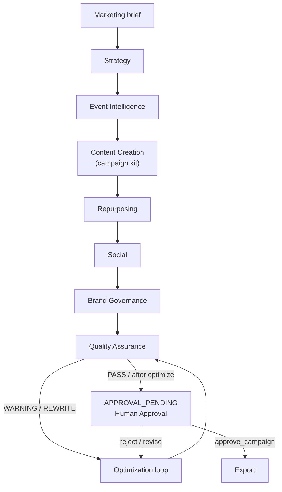

# Agent architecture

This repository implements **11 specialist capabilities** behind a public MCP surface, plus a **campaign orchestrator** that sequences them and stops at human approval.

## Capability map (implementation truth)

| # | Capability | Entry point | MCP tool(s) | Input | Output | Dependencies | Failure mode | Tests | Human approval? |
|---|---|---|---|---|---|---|---|---|---|
| 1 | Strategy | `clients.public_api.generate_content_strategy` | `generate_content_strategy` | goals JSON | strategy | none | empty goals → defaults | e2e | No |
| 2 | Event Intelligence | `core.event_brief.intake` | `process_event_brief` | event/marketing brief | READY / NEEDS_CLARIFICATION | validators, optional GC refs | missing fields | test_event_brief | No |
| 3 | Content Creation | `core.generators.*` / campaign kit | `generate_campaign_kit`, `generate_content_asset` | brief / asset_type | kit or asset | factory, brand context | unsupported type | campaign kit / factory tests | No |
| 4 | Refinement | optimizer via refine | `refine_content_asset` | asset_id + feedback | optimized asset | LLM router | unknown asset_id | test_step10 | No |
| 5 | Social | `generate_social_posts` | `generate_social_posts` | source + platforms | social assets | repurposer | empty platforms | e2e | No |
| 6 | Repurposing | `repurpose_content_asset` | `repurpose_content_asset` | source + formats | assets | repurposer + LLM | empty formats | test_step10 | No |
| 7 | Optimization | `optimize_content_asset` | `optimize_content_asset` | asset + QA feedback | optimized asset | LLM router | provider errors | test_step10 | No |
| 8 | Brand Governance | `core.brand.rules` + QA brand check | used by QA + orchestrator brand stage | text/asset | validation result | `brand_rules.json` | forbidden jargon / terminology | test_brand, QA | Before approval |
| 9 | Quality Assurance | `core.qa.engine` | `qa_validate_asset` | content + type | PASS/WARNING/REWRITE | brand, originality, emailens | rewrite required | test_qa_step9 | Required flag always true |
| 10 | Human Approval | `core.approval.gate` + campaign SM | `approve_campaign_kit`, `approve_campaign` | kit/campaign id | approval record | state machine | illegal transitions | state machine + e2e | **Yes — mandatory** |
| 11 | Export | `exporters.campaign` | `export_campaign_kit`, `export_campaign` | id + format | file path | approval gate | PermissionError if unapproved | test_step10, e2e | Must be approved |

Orchestration tools: `create_campaign`, `get_campaign_status`, `resume_campaign` (`core/campaign/`).

## Actual workflow (orchestrator)

`create_campaign` implements this sequence and **stops at APPROVAL_PENDING**:



Notes vs a linear “refinement before social” diagram:

- Refinement is available as an on-demand tool (`refine_content_asset`) and via the optimization loop after QA — not a fixed pre-social stage in `create_campaign`.
- Brand governance runs as a dedicated stage and again inside QA.

## Campaign status machine

```text
DRAFT → GENERATED → QA_PENDING → QA_PASSED → APPROVAL_PENDING → APPROVED → EXPORTED
```

Forbidden examples (enforced in `core/campaign/state_machine.py`):

- `QA_FAILED → APPROVED`
- `APPROVAL_PENDING → EXPORTED`

## Persistence / resume

Campaign JSON files: `{DATA_DIR}/campaigns/{campaign_id}.json` (default `./data/campaigns/`).

`resume_campaign` continues incomplete stages or reports when waiting on approval/export.

## LLM providers

```text
Agent / tool
  → core.llm.router.LLMRouter
    → mock | anthropic | openai | gemini adapters
```

Automated tests use `LLM_PROVIDER=mock` only.
